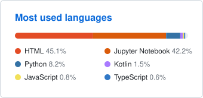

<h1 align="center">Rodolfo Londero</h1>

  <b>Senior RPA Engineer</b> &nbsp;·&nbsp; UiPath Specialist &nbsp;·&nbsp; Technical Lead 
  Electrical Engineer (M.Sc.) building enterprise automation

  
  
  
  
  

  <b>English</b> &nbsp;|&nbsp; <a href="README.pt-BR.md">Português</a>

---

## About

I design, develop and lead end-to-end enterprise automation — from architecture and code review to production governance. My work centres on UiPath REFramework extended with custom components in C#, VB.NET and Python, so critical processes depend on APIs rather than fragile UI interactions.

My background is in Electrical Engineering (M.Sc., UFSM), which is why you'll find power-systems and scientific-computing work sitting next to the RPA repositories here. Both sides feed each other: the engineering habits shape how I build automation, and automation makes the engineering work reproducible.

- 🤖 Enterprise RPA with UiPath REFramework, attended and unattended
- 🔗 Integrations with SAP, SharePoint, Microsoft 365 and REST APIs
- ⚡ Power systems and scientific computing with OpenDSS, MATLAB, Ansys and Python
- 🧠 Bringing AI into automation workflows
- 📍 Alegrete, Rio Grande do Sul, Brazil

## Tech Stack

**Automation & .NET**

**Integrations & DevOps**

**Engineering & Scientific Computing**

   <b>MATLAB</b> &nbsp;&nbsp;
   <b>OpenDSS</b> &nbsp;&nbsp;
  
  
  
  

## Featured Projects

**Automation & RPA**

- **[ConvertDateTime](https://github.com/rodolfoplondero/ConvertDateTime)** — UiPath automation that converts date/time values between arbitrary input and output formats. MIT licensed.
- **[uipath-examples](https://github.com/rodolfoplondero/uipath-examples)** — Collection of UiPath workflow examples kept as a working reference.

**Electrical Engineering**

- **[py_dss_vis](https://github.com/rodolfoplondero/py_dss_vis)** — Python package for visualising results produced by `py_dss_tools`, with a CI test suite.
- **[opendss-codes](https://github.com/rodolfoplondero/opendss-codes)** — OpenDSS tutorials, including the material from the PES Day minicourse at UFSM.
- **[mestrado-codes](https://github.com/rodolfoplondero/mestrado-codes)** — M.Sc. research code: Fluent–Maxwell coupling via a UDF in C, air property models and result plotting.

## Open Source

- **[py_dss_interface](https://github.com/PauloRadatz/py_dss_interface)** — contributing to the Python interface for OpenDSS, used for power distribution system studies.

## Certification

## GitHub Analytics

  <a href="https://rodolfoplondero.github.io/#analytics">
    <picture>
      <source media="(prefers-color-scheme: dark)" srcset="assets/stats-dark.svg">
      
    </picture>
  </a>
  <a href="https://rodolfoplondero.github.io/#analytics">
    <picture>
      <source media="(prefers-color-scheme: dark)" srcset="assets/langs-dark.svg">
      
    </picture>
  </a>

Regenerated weekly by <a href=".github/workflows/stats.yml">a workflow in this repository</a>. Click either card for the <a href="https://rodolfoplondero.github.io/#analytics">interactive version</a>.

<!-- stats:start -->
<!-- stats:end -->

---

  Open to conversations about automation, power systems and everything in between. 
  <a href="https://rodolfoplondero.github.io">rodolfoplondero.github.io</a>

  

